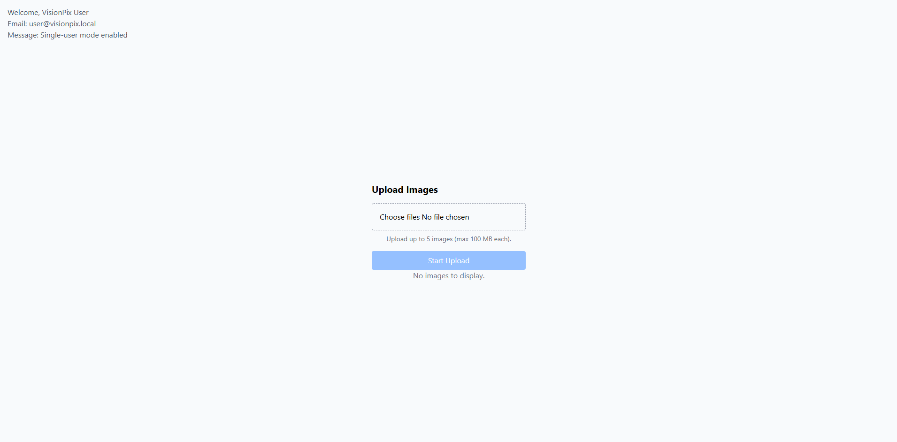
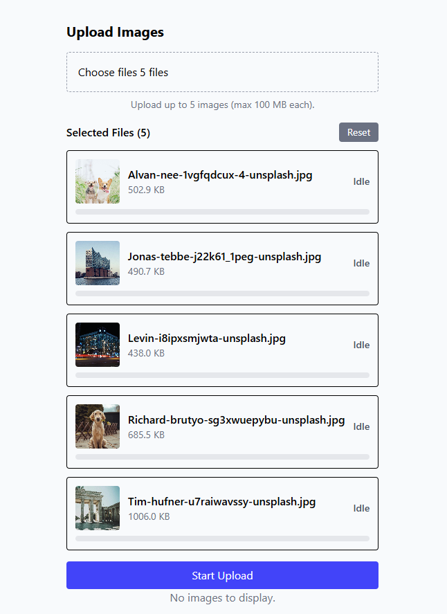
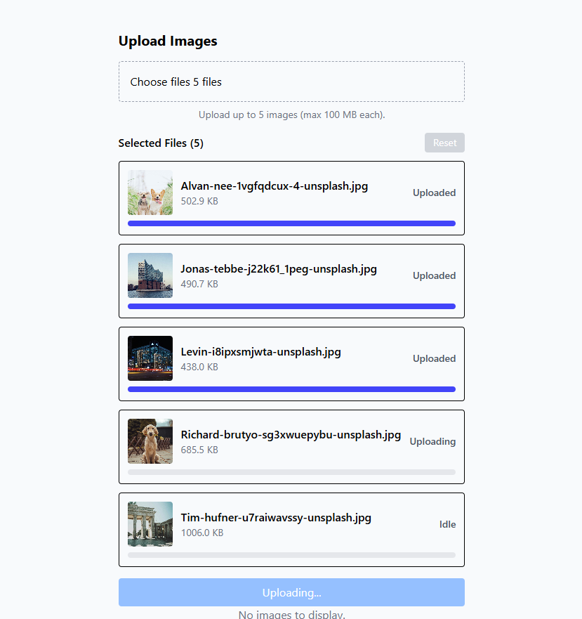
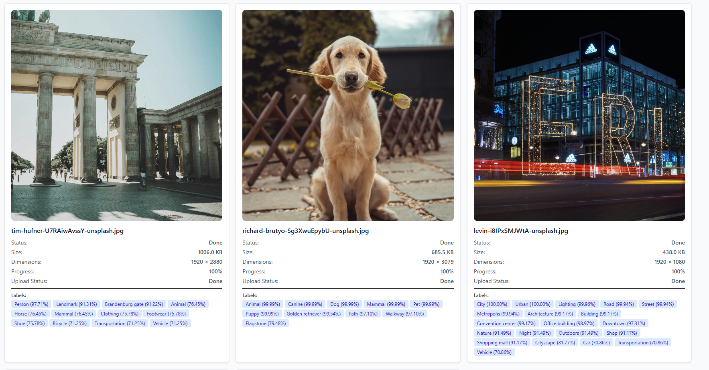

# VisionPix - Image Upload & Labeling Service

A full-stack application for uploading images, processing them with AWS Rekognition, and viewing labels and metadata.

## Features

- Upload multiple images with progress tracking
- Automatic image labeling using AWS Rekognition
- View image metadata (dimensions, size, labels)
- Real-time processing status updates
- Image previews with labels and confidence scores

## Prerequisites

- **Docker** installed
- **AWS Account** with S3 bucket and Rekognition access
- **AWS IAM credentials** with permissions for:
  - S3 (read/write)
  - Rekognition (detect labels)

## Quick Start

1. Create `.env` file from `env.example`
2. Put your **AWS credentials** in the `.env` file

```
AWS_ACCESS_KEY_ID=your-access-key
AWS_SECRET_ACCESS_KEY=your-secret-key
```

3. Run `docker-compose up -d`

### Access the Application

- **Frontend:** http://localhost:5173
- **Backend GraphQL Playground:** http://localhost:3000/graphql

## How It Works

1. **Upload:** Select images in the frontend
2. **Storage:** Images are uploaded directly to S3 using presigned URLs
3. **Processing:** Backend processes images asynchronously using BullMQ
4. **Labeling:** AWS Rekognition detects objects and scenes
5. **Display:** Frontend shows images with labels and metadata

## Stopping the Application

Press `Ctrl+C` in the terminal, or run:

```bash
docker-compose down
```

To remove all data (including database):

```bash
docker-compose down -v
```

### Database Connection Issues

Make sure:

- `.env` file exists and has correct values
- `DATABASE_URL` uses `postgres` as host (Docker service name)
- Database credentials match between `.env` and `docker-compose.yml`

### AWS Credentials

Ensure your AWS credentials have:

- S3 bucket access (read/write)
- Rekognition permissions (detect labels)
- Correct region configuration

## Tech Stack

- **Frontend:** React, TypeScript, Vite, Apollo Client, Tailwind CSS
- **Backend:** NestJS, GraphQL, Prisma, BullMQ
- **Database:** PostgreSQL
- **Queue:** Redis
- **Storage:** AWS S3
- **AI:** AWS Rekognition
- **Deployment:** Docker, Docker Compose

## Screenshots






Image copyright - https://unsplash.com/
